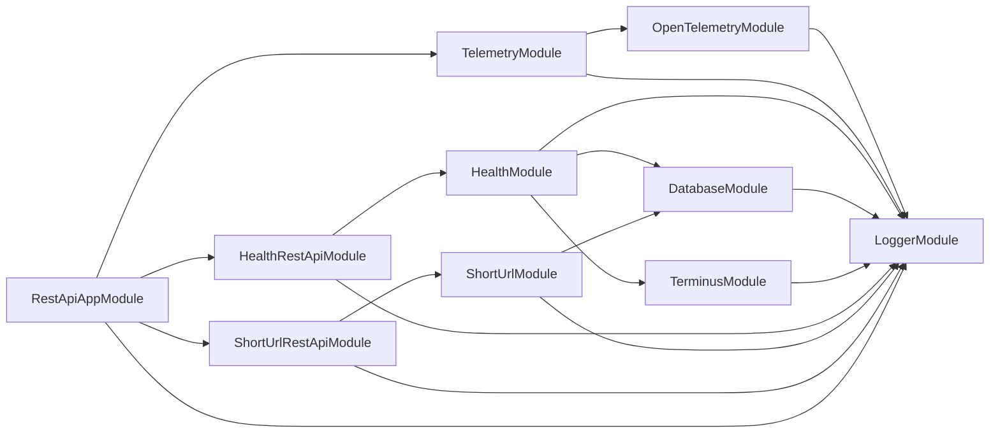
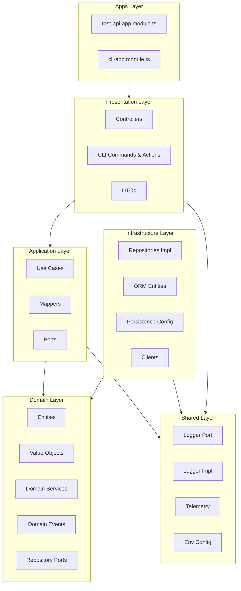

## Conceitos do Domain-Driven Design (DDD)

- _bounded context_: É uma prática que visa facilitar e dar coerência ao desenvolvimento em cima de um modelo extenso no qual entidades possam ter significados e responsabiliaddes diferentes dependendo do contexto no qual elas se aplicam.
- _Shared Kernel Pattern_: Um conceito onde um pequeno subconjunto do modelo de domínio é compartilhado entre múltiplos contextos delimitados (bounded contexts) ou módulos. Esse subconjunto geralmente inclui estruturas de dados comuns, classes utilitárias ou serviços que são essenciais para várias partes do sistema.
- _Driving adapter_: como o mundo externo conversa com a aplicação (entrada). Entram com input e disparam casos de uso. Exemplos: REST Controller, GraphQL Resolver, CLI.
- _Driven adapter_: como a aplicação conversa com o mundo externo (saída). Implementam dependências externas chamadas pelos casos de uso. Exemplos: Repositórios (DB), APIs externas, Message brokers.

## Grafo de dependência entre módulos

## Organização dos arquivos

### Em `src/apps/`

- Cada "aplicação" concreta que consome os módulos de domínio (rest-api, cli).
- Esse diretório é o entrypoint da camada Driving.
- Ele junta:
  + Configuração específica do runtime. Arquivos com sufixo `.main.ts`.
  + O módulo raiz da aplicação. Arquivo com sufixo `.module.ts`
- Bom isolamento:
  + se amanhã você quiser rodar o mesmo short-url como GraphQL API, basta criar `src/apps/graphql-api`

### Em `src/shared/`

- O que é cross-cutting concern e não pertence a uma feature.
- Exemplo: logger, configuração, telemetry, middlewares, openAPI docs.
- Mantém o princípio 'Don’t repeat yourself' (DRY) entre Bounded Contexts, mas sem misturar coisas de domínio.
- Tudo bem separado em `src/shared/kernel/domain` (contratos base de erros e eventos), isso evita dependência circular entre contextos distintos.

### Em `src/short-url/`

- Implementa o bounded context 'encurtador de URL'
- Dentro dele, você tem uma mini-hexagonal architecture, organizada por camadas:
  + `domain/`:
    - Entidades, value objects (VOs), eventos, erros. Todos definidos de forma agnóstica a frameworks.
    - Port de repositório → contrato que a aplicação conhece.
    - Serviços de domínio → encapsulam lógica pura.
  + `application/`:
    - Use cases para orquestrar o domínio. Arquivos com sufixo `.use-case.ts`
    - Mappers entre DTO e entidade e vice-versa. Arquivos com sufixo `.mapper.ts`
    - Nada que dependa de infra.
  + `infrastructure/`:
    - Implementações dos ports (repositories). Arquivos com sufixo `.repository.ts`
    - Configuração de banco.
    - Data model do ORM para não poluir domain. Arquivos com sufixo `.db.entity.ts`
  + `presentation/`:
    - Driving Adapters (eg: REST APIs, CLI, GraphQL APIs).
    - Cada um isolado em seu módulo para evitar circularidades e para controlar as necessidades específicas de cada apresentação.
    - DTOs de input/output ficam junto da camada de apresentação pois eles são formatos de transporte, não domínio.

## Grafo de dependência

